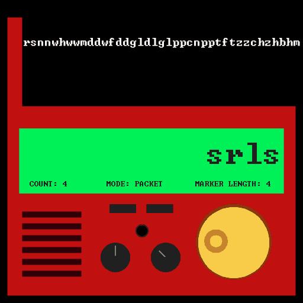
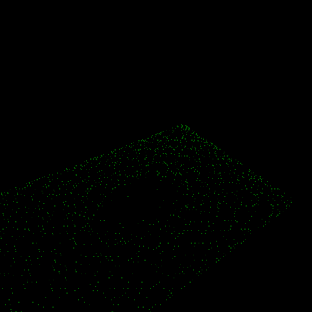

# Advent of Code

[Advent of Code](https://adventofcode.com) is an Advent calendar of programming puzzles. The puzzles  
generally increase in difficulty each day. It is a lot of fun.  

### Visualizations

#### [2021 Day 9: Smoke Basin](aoc2021/09-smoke-basin)

#### [2021 Day 13: Transparent Oragami](aoc2021/13-transparent-origami)
  

#### [2022 Day 3: Rucksack Reorganization](aoc2022/03-rucksack-reorganization)
  

#### [2022 Day 4: Camp Cleanup](aoc2022/04-camp-cleanup)

#### [2022 Day 5: Supply Stacks](aoc2022/05-supply-stacks)

#### [2022 Day 6: Tuning Trouble](aoc2022/06-tuning-trouble)

#### [2022 Day 7: No Space Left On Device](aoc2022/07-no-space-left-on-device)

#### [2022 Day 8: Treetop Tree House](aoc2022/08-treetop-tree-house)

#### [2022 Day 9: Rope Bridge](aoc2022/09-rope-bridge)

