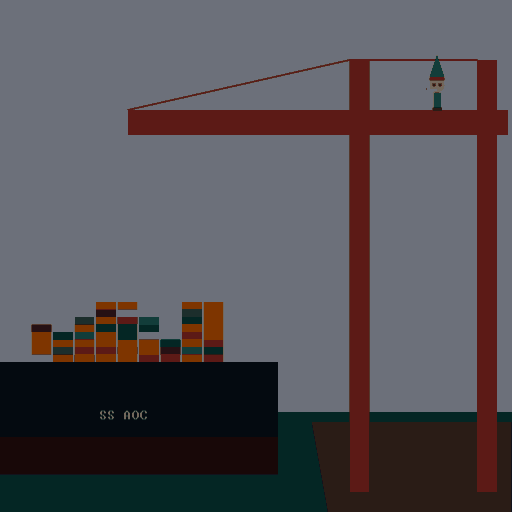

# Advent of Code

[Advent of Code](https://adventofcode.com) is an Advent calendar of programming puzzles. The puzzles  
generally increase in difficulty each day. It is a lot of fun.  

### Visualizations

#### 2021 Day 9 - Smoke Basin  
  

#### 2021 Day 13 - Transparent Oragami  
  

#### 2022 Day 3: Rucksack Reorganization  
  

#### 2022 Day 4: Camp Cleanup

#### 2022 Day 5: Supply Stacks

