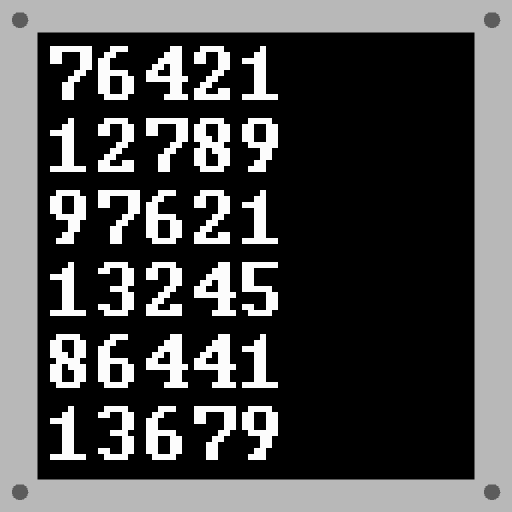
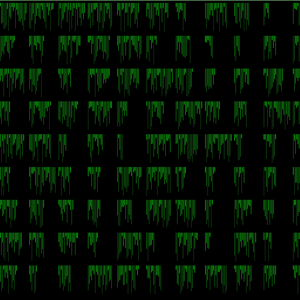
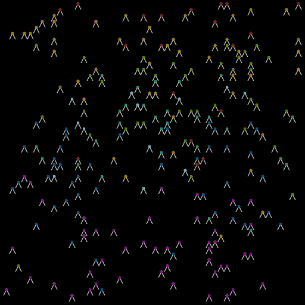
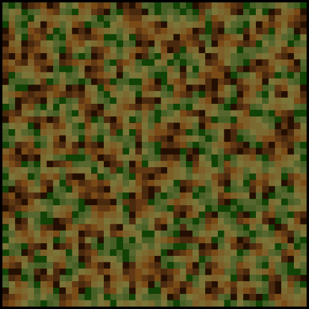

# Advent of Code 2024

### Visualizations

#### [Day 1: Historian Hysteria](01-historian-hysteria)

#### [Day 2: Red-Nosed Reports](02-red-nosed-reports)

#### [Day 3: Mull It Over](03-mull-it-over)

#### [Day 4: Ceres Search](04-ceres-search)

#### [Day 5: Print Queue](05-print-queue)

#### [Day 6: Guard Gallivant](06-guard-gallivant)

#### [Day 7: Bridge Repair](07-bridge-repair)

#### [Day 8: Resonant Collinearity](08-resonant-collinearity)

#### [Day 9: Disk Fragmenter](09-disk-fragmenter)

#### [Day 10: Hoof It](10-hoof-it)

